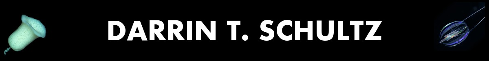

Scientist and naturalist. I explore the world to understand the origin of animals and unique life on Earth. Read more about me on my [personal website](https://darrinschultz.com).

### Now Hiring!

Currently seeking motivated PhD students and postdocs to join my lab at [Lehigh University](https://bio.cas.lehigh.edu/) and [Lehigh Oceans](https://www.lehighoceans.org/). If you are interested in evolutionary genomics, chromosome biology, or molecular technology development, please reach out! [[Apply for postdoc position]](https://careers.pageuppeople.com/865/cw/en-us/job/503761/postdoctoral-research-associate-in-evolutionary-genomics-molecular-evolution)

## Science

I bridge chromosome-scale genomics, evolutionary biology, and molecular technology development.

Selected work:
- Tracing chromosomal changes to detangle early events in animal history and understand the deep branch points in the animal tree. [Nature 2023](https://www.nature.com/articles/s41586-023-05936-6)
- Characterizing how animal chromosomes changed over their 1-billion year history. [bioRxiv 2024](https://www.biorxiv.org/content/10.1101/2024.07.29.605683v1)
- Uncovering the unique chromosome biology of the Pacific sea gooseberry comb jellyfish. [G3 2021](https://academic.oup.com/g3journal/article/11/11/jkab302/6358137)

## Featured Repositories
- [odp](https://github.com/conchoecia/odp) — Oxford dot plots for comparing chromosome-scale genomes and synteny relationships. Published in [Nature 2023](https://www.nature.com/articles/s41586-023-05936-6).
- [pauvre](https://github.com/conchoecia/pauvre) — QC and plotting for long-read sequencing. Published in [Bioinformatics 2018](https://academic.oup.com/bioinformatics/article/34/15/2666/4934939)
- [genome_assembly_pipelines](https://github.com/conchoecia/genome_assembly_pipelines) — poorly documented but very useful scripts for assembling genomes.

## Links
- [Lab Website](https://evogeno.me)
- [Personal Website](https://darrinschultz.com)
- [Publications (Google Scholar)](https://scholar.google.com/citations?user=RLOqOTgAAAAJ&hl=en)
- [ORCID](https://orcid.org/my-orcid?orcid=0000-0003-1190-1122)
- [LinkedIn](https://www.linkedin.com/in/darrintschultz)

## Contact
Email: dts [at] lehigh [dot] edu
